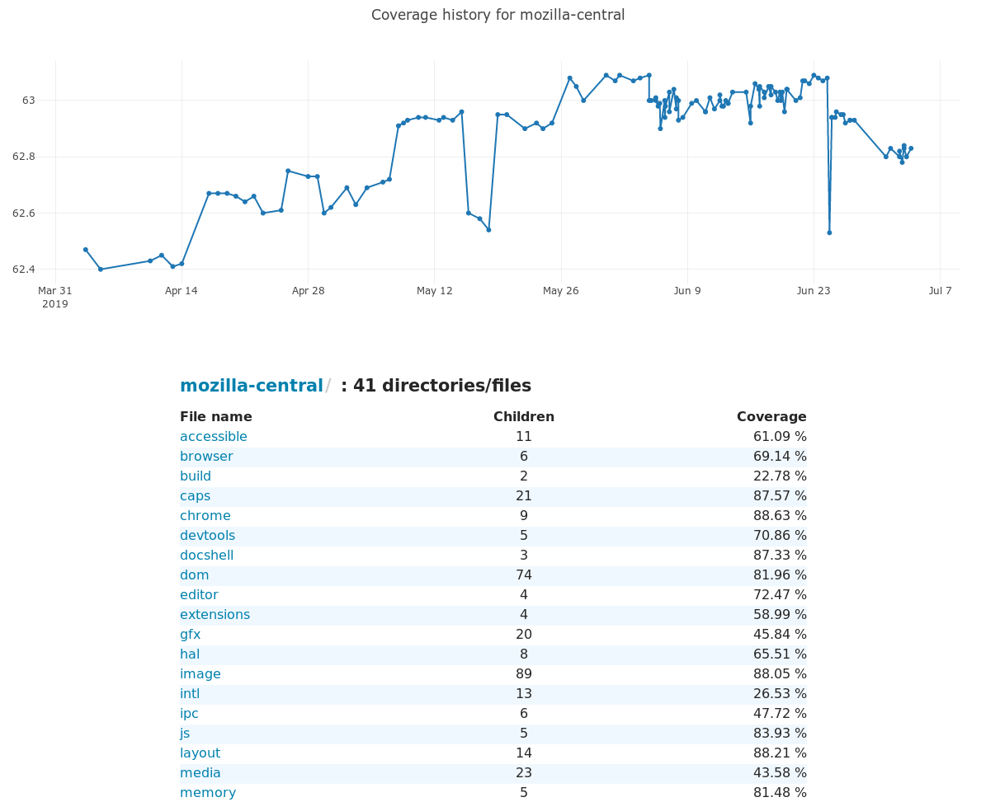

# Mozilla Code Coverage frontend

This is a simple JavaScript application displaying information from the Mozilla code coverage backend (hosted as https://coverage.moz.tools)

You can use it right now from [coverage.moz.tools](https://coverage.moz.tools/)

## File viewer

You can browse the aggregated code coverage data for mozilla-central, per directory, then view file coverage in detail.



## Zero coverage reports

We've also [developed a page](https://coverage.moz.tools/#view=zero) to easily browse the directories & files with no coverage: these files are interesting because they can sometimes be removed altogether from mozilla-central...

## Developer setup

It's a pretty simple Single Page application setup using webpack:

```console
npm install
npm run start
```

The frontend should now be available on http://localhost:9000/ and will use a backend running on http://localhost:8000/

You can specify another remote backend like so:

```
BACKEND_URL=https://api.coverage.moz.tools npm run start
```

## Help

You can reach us on our Matrix instance: [#codecoverage:mozilla.org](https://chat.mozilla.org/#/room/#codecoverage:mozilla.org)
